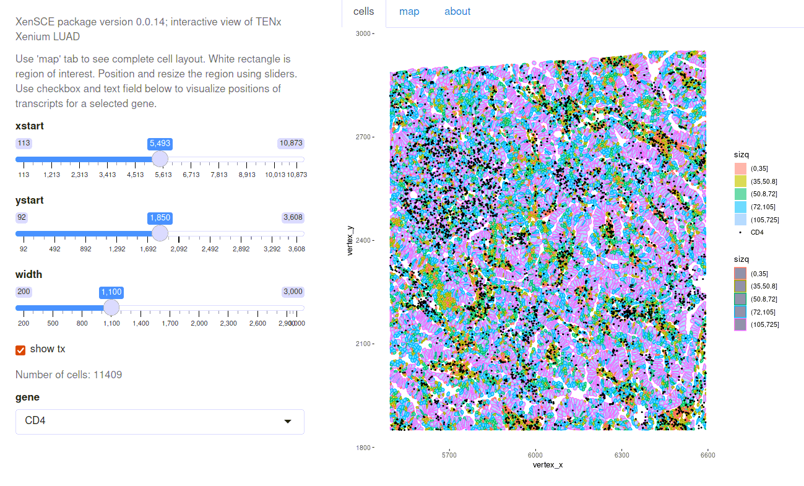

# xenLite

This package experimentally explores an
S4 class and methods for 10x Xenium demonstration data in Open Storage Network.

## Installation
```
BiocManager::install("vjcitn/xenLite")
```

## Basics

The package

- defines a class `XenSPEP` that extends SpatialExperiment, accommodating
geometry information for cells, nuclei, and transcripts in parquet files that
as of 0.0.17 are ingested by `arrow::read_parquet(..., as_data_frame=FALSE)`.
RAM consumption can be significant.

- includes functions to retrieve example data from NSF Open Storage Network buckets

A [pkgdown site](https://vjcitn.github.io/xenLite) is available.

## Interaction

A shiny app is available.  Some screenshots of earlier versions follow.

The rectangle shows a region of interest, selectable using sliders:


The details can include positions of transcripts for selected genes:


CD4-expressing cells seem complementary to those expressing EPCAM.



An example is available at [shinyapps.io](https://vjcitn.shinyapps.io/XenLUAD).

